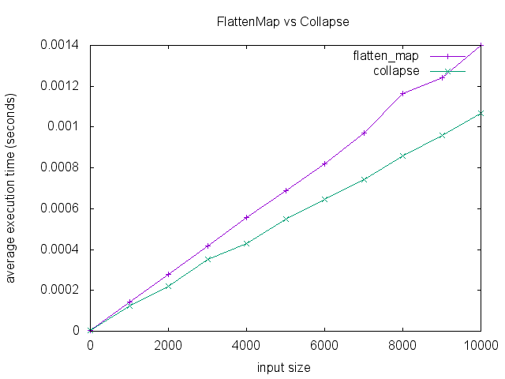

# Array#collapse

A C extension alternative to using `flatten.compact` or `flatten.map`.
Slight performance improvement (just a constant factor better) than the
common idioms, with exactly the same memory performance.



See [this blog post](http://mooreniemi.github.io/2016/09/15/flatten.html)
for the background and a chart of memory performance.

In addition, `collapse` makes two other slightly different choices from
core Ruby's `flatten`. 1. Attempting to `flatten` a recursive Array will
error normally. `collapse` just drops the recursive reference, and
continues on its merry way. 2. `collapse` doesn't accept
a [level](https://ruby-doc.org/core-2.2.0/Array.html#method-i-flatten)
argument. It's all or nothing.

## Disclaimer

Should you use this? Needing to compile a native extension for
a performance benefit that is not asymptotic is a trade-off I wouldn't
always make myself.

## Installation

Add this line to your application's Gemfile:

```ruby
gem 'array_collapse'
```

And then execute:

    $ bundle

Or install it yourself as:

    $ gem install array_collapse

## Usage

```ruby
2.2.2 :001 > require 'array_collapse'
 => true
2.2.2 :002 > [1, 2, [3], nil].collapse {|e| e.nil? ? e : e * 2 }
 => [2, 4, 6]
2.2.2 :003 > [1, [2, [3, nil]]].collapse
 => [1, 2, 3]
2.2.2 :004 > a = [1, [2, [3]]]
 => [1, [2, [3]]]
2.2.2 :005 > a << a
 => [1, [2, [3]], [...]]
2.2.2 :006 > a.collapse {|e| e * 3 }
 => [3, 6, 9]
2.2.2 :007 > a.flatten
 => ArgumentError: tried to flatten recursive array
```

## Contributing

Bug reports and pull requests are welcome on
[GitHub](https://github.com/mooreniemi/array_collapse). This project is
intended to be a safe, welcoming space for collaboration, and contributors
are expected to adhere to the [Contributor
Covenant](http://contributor-covenant.org) code of conduct.


## License

The gem is available as open source under the terms of the [MIT License](http://opensource.org/licenses/MIT).
